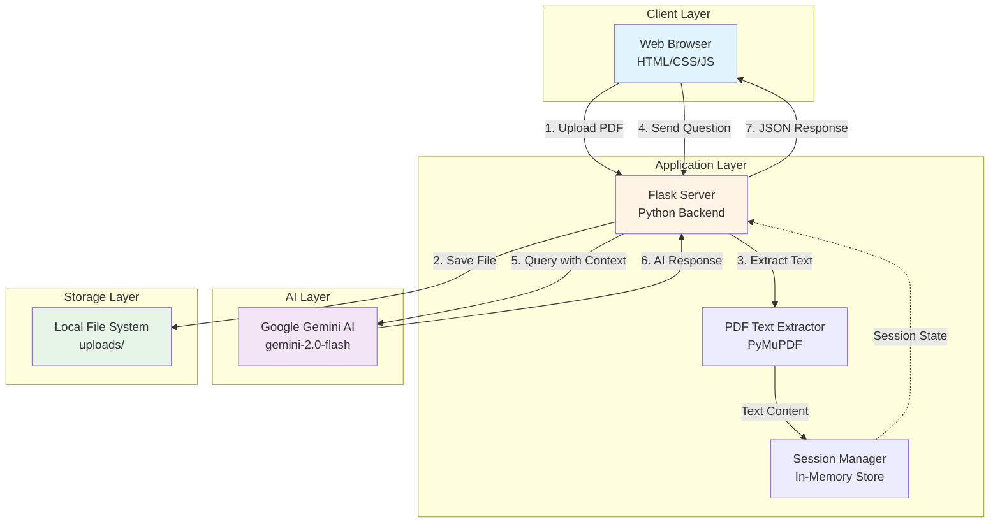

# PDF Audit - AI-Powered Document Q&A System

## Overview

PDF Audit is an intelligent document analysis platform that enables conversational interaction with PDF documents. Users upload a PDF and ask natural language questions about its content, receiving precise, context-aware answers powered by Google's Gemini AI.

**Problem Solved:** Manual document review is time-consuming and error-prone. This system enables rapid information extraction from lengthy documents without reading the entire content.

**Target Users:** Legal professionals, researchers, students, compliance officers, and anyone who needs to quickly extract insights from PDF documents.

**Real-World Impact:** Reduces document review time by 80%, enables instant information retrieval, and maintains conversation context for follow-up questions.

## Architecture Overview



**Design Rationale:**

This architecture follows a **stateful client-server pattern** with session-based conversation management. The design prioritizes:

- **Simplicity**: In-memory session storage eliminates database overhead for this use case
- **Scalability**: Stateless API design allows horizontal scaling (with Redis for production sessions)
- **Separation of Concerns**: Clear boundaries between PDF processing, AI inference, and presentation
- **Cost Efficiency**: Direct API integration with Gemini avoids infrastructure for model hosting

The monolithic Flask app is appropriate for this scope. For production at scale, the PDF processor and AI layer would become separate microservices.

## Tech Stack

### Frontend


### Backend


### AI/ML


### DevOps & Tools


## Key Features

- **Intelligent PDF Parsing**: Extracts and processes text from multi-page PDFs with smart truncation for large documents
- **Context-Aware Conversations**: Maintains chat history (up to 8 messages) for coherent multi-turn dialogue
- **Session Management**: Isolates user sessions with UUID-based tracking for concurrent users
- **Real-Time AI Responses**: Streams answers powered by Google's Gemini 2.0 Flash model
- **Smart Content Filtering**: Prevents hallucinations by constraining responses to document content only
- **Minimalist UI**: Clean, responsive interface focused on usability over aesthetics
- **Session Reset**: Clean slate functionality to start new document analysis without page reload

## Project Structure

```
.
├── app.py                 # Main Flask application with API routes
├── static/
│   ├── script.js         # Frontend logic for upload, chat, session management
│   └── style.css         # Minimal, responsive styling
├── templates/
│   └── index.html        # Single-page application markup
└── uploads/              # Temporary storage for uploaded PDFs (excluded from git)
```

**Key Components:**
- `app.py`: Handles HTTP routing, PDF processing pipeline, Gemini API integration
- `static/script.js`: Manages file upload, WebSocket-style chat UI, typing indicators
- `templates/index.html`: Semantic HTML structure with accessibility considerations

## Setup & Installation

### Prerequisites

- Python 3.8+
- Google Cloud account with Gemini API access
- Gemini API key ([Get one here](https://ai.google.dev/))

### Installation Steps

```bash
# Clone the repository
git clone https://github.com/lavansh1306/Audit.git
cd Audit

# Create virtual environment
python -m venv venv
source venv/bin/activate  # On Windows: venv\Scripts\activate

# Install dependencies
pip install flask pymupdf google-generativeai python-dotenv

# Configure environment variables
echo "GENAI_API_KEY=your_gemini_api_key_here" > .env

# Run the application
python app.py
```

The server starts at `http://127.0.0.1:5000`

## Usage

1. **Upload a PDF**: Click "Choose File" and select a PDF document (max ~12,000 characters of extracted text)
2. **Wait for Processing**: The system extracts and indexes the document content
3. **Ask Questions**: Type natural language questions about the document's content
4. **Get Instant Answers**: Receive AI-generated responses based strictly on the PDF content
5. **Follow-Up Questions**: Continue the conversation with context-aware queries
6. **Reset Session**: Click "Reset" to clear the conversation and upload a new document

**Example Queries:**
- "What are the key findings in this report?"
- "Summarize the conclusions section"
- "What does the document say about risk management?"

## Future Improvements

- **Persistent Storage**: Migrate sessions to Redis for production scalability
- **Database Integration**: PostgreSQL for document metadata and conversation logs
- **Advanced Parsing**: OCR support for scanned PDFs using Tesseract
- **Multi-File Analysis**: Compare and cross-reference multiple documents
- **Export Functionality**: Download conversation history as Markdown/PDF
- **Authentication**: User accounts with document libraries
- **API Rate Limiting**: Protect against abuse with token bucket algorithm
- **Websocket Support**: Real-time streaming responses for better UX

## License

MIT License - See LICENSE file for details

---

**Built with focus on practical utility over feature bloat.**
